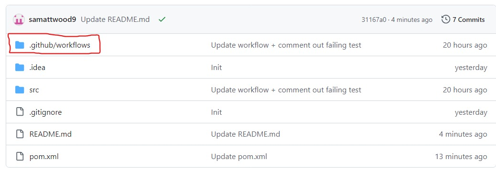

# README

Follow the instructions below to set-up CI for this repository.

## Step 1

Add the following your `pom.xml` file:

```
<build>
  <plugins>
    <plugin>
      <groupId>org.apache.maven.plugins</groupId>
      <artifactId>maven-surefire-plugin</artifactId>
      <version>2.22.2</version>
    </plugin>
  </plugins>
</build>
```
Afterwards, your `pom.xml` file should look like this:

```
<?xml version="1.0" encoding="UTF-8"?>
<project xmlns="http://maven.apache.org/POM/4.0.0"
         xmlns:xsi="http://www.w3.org/2001/XMLSchema-instance"
         xsi:schemaLocation="http://maven.apache.org/POM/4.0.0 http://maven.apache.org/xsd/maven-4.0.0.xsd">
    <modelVersion>4.0.0</modelVersion>

    <groupId>org.example</groupId>
    <artifactId>MinimalCIStarter</artifactId>
    <version>1.0-SNAPSHOT</version>

    <properties>
        <maven.compiler.source>22</maven.compiler.source>
        <maven.compiler.target>22</maven.compiler.target>
        <project.build.sourceEncoding>UTF-8</project.build.sourceEncoding>
    </properties>
    
    <dependencies>
        <dependency>
            <groupId>org.junit.jupiter</groupId>
            <artifactId>junit-jupiter</artifactId>
            <version>5.8.1</version>
            <scope>test</scope>
        </dependency>
    </dependencies>

    <build>
        <plugins>
            <plugin>
                <groupId>org.apache.maven.plugins</groupId>
                <artifactId>maven-surefire-plugin</artifactId>
                <version>2.22.2</version>
            </plugin>
        </plugins>
    </build>
</project>
```

This code configures the Maven Surefire Plugin, which is used during the test phase of the build lifecycle to execute the unit tests of an application. It integrates well with continuous integration pipelines, as we will (hopefully) see very soon!

## Step 2

Create 2 new folders. The first should be a `.github` folder at the top level of this repository. The second should a `workflows` folder inside the `.github` folder.

Any easy way of doing this is by changing the url that is shown in your browser from `github.com/your_user_name/MinimalCIStarter` to `github/dev/your_user_name/MinimalCIStarter`. Doing this will open up a browser-based version of Visual Studio Code that you can use to create the folders.

After you have created the folders, be sure to commit and push your changes.

After you've created the folder and returned to `github.com/your_user_name/MinimalCIStarter` your repository should look a bit like this:


