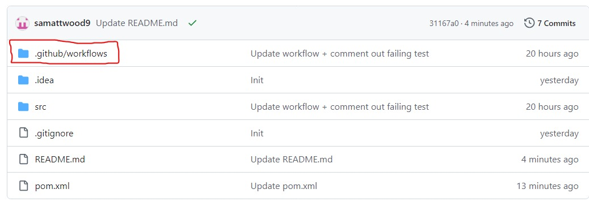
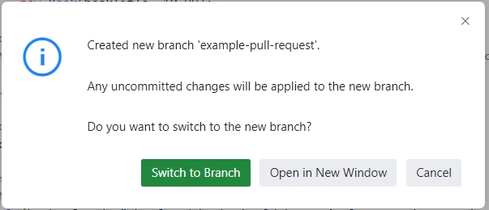

# README

Follow the instructions below to set-up CI for this repository.

## Step 1

Add the following your `pom.xml` file:

```
<build>
  <plugins>
    <plugin>
      <groupId>org.apache.maven.plugins</groupId>
      <artifactId>maven-surefire-plugin</artifactId>
      <version>2.22.2</version>
    </plugin>
  </plugins>
</build>
```
Afterwards, your `pom.xml` file should look like this:

```
<?xml version="1.0" encoding="UTF-8"?>
<project xmlns="http://maven.apache.org/POM/4.0.0"
         xmlns:xsi="http://www.w3.org/2001/XMLSchema-instance"
         xsi:schemaLocation="http://maven.apache.org/POM/4.0.0 http://maven.apache.org/xsd/maven-4.0.0.xsd">
    <modelVersion>4.0.0</modelVersion>

    <groupId>org.example</groupId>
    <artifactId>MinimalCIStarter</artifactId>
    <version>1.0-SNAPSHOT</version>

    <properties>
        <maven.compiler.source>22</maven.compiler.source>
        <maven.compiler.target>22</maven.compiler.target>
        <project.build.sourceEncoding>UTF-8</project.build.sourceEncoding>
    </properties>
    
    <dependencies>
        <dependency>
            <groupId>org.junit.jupiter</groupId>
            <artifactId>junit-jupiter</artifactId>
            <version>5.8.1</version>
            <scope>test</scope>
        </dependency>
    </dependencies>

    <build>
        <plugins>
            <plugin>
                <groupId>org.apache.maven.plugins</groupId>
                <artifactId>maven-surefire-plugin</artifactId>
                <version>2.22.2</version>
            </plugin>
        </plugins>
    </build>
</project>
```

This code configures the Maven Surefire Plugin, which is used during the test phase of the build lifecycle to execute the unit tests of an application. It integrates well with continuous integration pipelines, as we will (hopefully) see very soon!

## Step 2

Create 2 new folders. The first should be a `.github` folder at the top level of this repository. The second should a `workflows` folder inside the `.github` folder.

Any easy way of doing this is by changing the url that is shown in your browser from `github.com/your_user_name/MinimalCIStarter` to `github.dev/your_user_name/MinimalCIStarter`. Doing this will open up a browser-based version of Visual Studio Code that you can use to create the folders.

After you have created the folders, be sure to commit and push your changes.

After you've created the folder and returned to `github.com/your_user_name/MinimalCIStarter` your repository should look a bit like this:



## Step 3

Inside your `workflows` folder create a `tests.yml` file. Add the following contents to the file (again, you might like to use `github.dev` to do this):

```
name: Java CI with Maven

on: [push, pull_request]

jobs:
  test:
    runs-on: ubuntu-latest

    steps:
    - name: Checkout code
      uses: actions/checkout@v2

    - name: Set up JDK 22
      uses: actions/setup-java@v2
      with:
        java-version: 22
        distribution: 'adopt'

    - name: Run tests
      run: mvn test
```

After you have done this, be sure to commit and push your changes.

After you've returned to `github.com/your_user_name/MinimalCIStarter` your should notice an orange circle icon next to your commit message, like this:


After waiting a couple of minutes, refresh the page. You should then notice that orange circle has changed to a green tick, like this:


## Step 4

To better understand the value of CI you could now create a pull request to see it in action. There are many ways you could do this, but using the `github.dev` interface as detailed below is one option.

To begin creating a pull request, you should first create a new branch. Do this by clicking the name of your current branch (i.e., main); It should be visible towards the bottom left corner of your the `github.dev` IDE, like this:


After clicking the button, a pop-up will appear. When it does, select the `Create new branch...` option and enter a name for your branch when prompted. You should then see a dialog that looks like this:



Click the green `Switch to Branch` button. After doing this, you should notice that your current branch has changed, with a different branch name being visible towards the bottom left corner, like this:


Now that you're on a new branch, make some changes to the code to better understand the value of CI. To do this, navigate to the following file using the Sidebar: `src/test/java/BookStoreTest.java`:


After opening this file, scroll down to the end of it and you should notice a test that has been commented out, like this:

```java
/* @Test
void aFailingTest() {
  fail();
} */
```

Uncomment this test (which is clearly designed to fail), like this:

```java
@Test
void aFailingTest() {
  fail();
} 
```

Now commit and push your changes.


